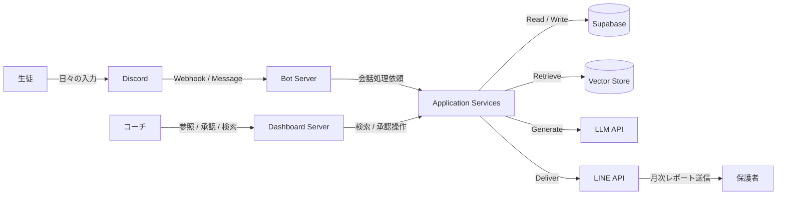
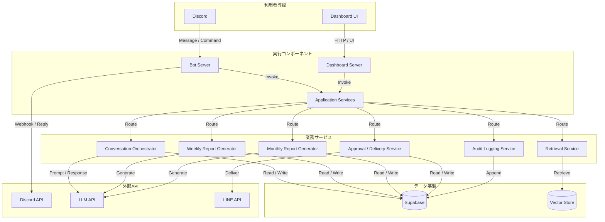
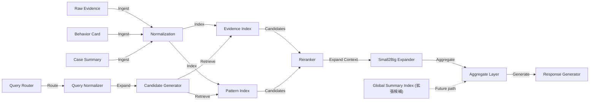
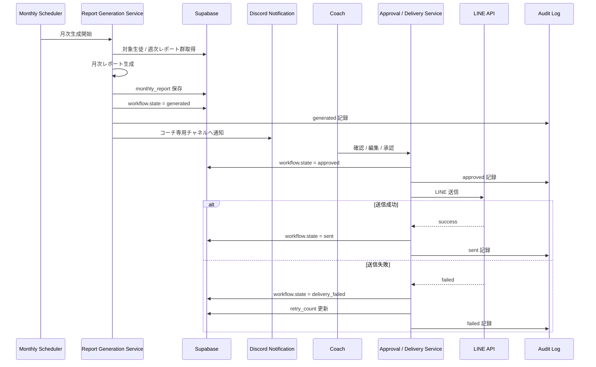
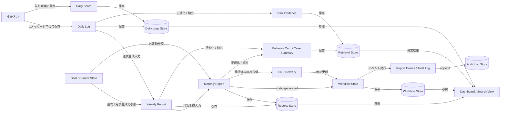
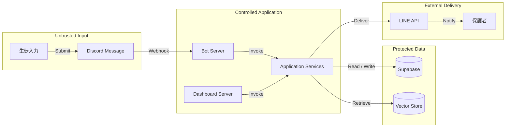
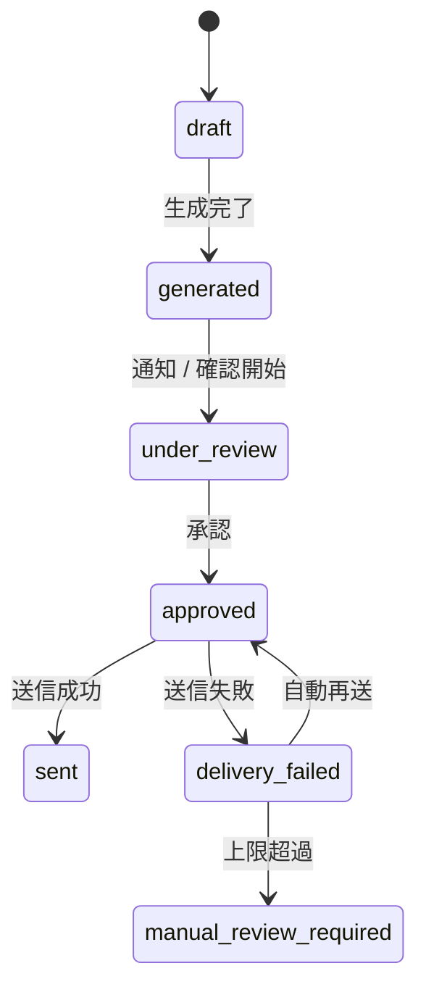
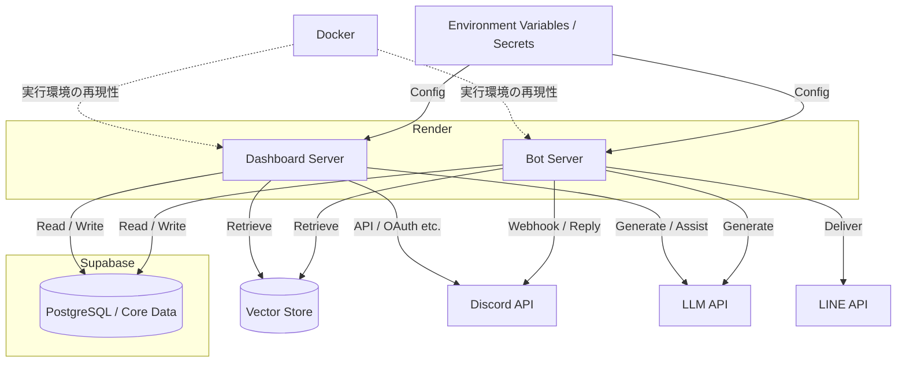

# アーキテクチャ

## 目的

このドキュメントでは、コーチング事業向けAI実行基盤と管理ダッシュボードのシステム構成を整理する。  
対象は、Discord 上の日々の対話、面談後の週次レポート生成、保護者向け月次レポート生成、承認付き送信、生徒情報の参照と検索を支えるコンポーネントである。

ここでは、事業背景や導入効果ではなく、どのコンポーネントに何の責務を置き、どこで状態を管理し、どこに信頼境界を引いたかを記述する。  
また、主要ランタイムフローとデータフローもこの文書に統合し、構成、処理、データライフサイクルを一続きで読めるようにする。

## 図の読み方

- 長方形: 実行コンポーネントまたは処理ステップ
- 円筒: 永続化ストア
- 実線: 実装済みの経路
- 破線: 拡張候補
- 矢印ラベル: 関係の方向と用途

この記法は、図単体で理解できること、要素タイプと関係を明示することを優先している。

---

## システム全体像

システムの外部接点は、生徒、コーチ、保護者の3者である。  
生徒の主導線は Discord、コーチの主導線は管理画面、保護者への通知は LINE を使う。  
入力、検索、生成、承認、送信は一連の運用フローとして接続されているが、責務は内部で分離している。

---

## コンテナ構成

この構成では、Bot と管理画面を分離している。  
Bot は入力と通知、管理画面は参照と承認、Application Services は状態遷移と業務ロジックを担当する。  
送信判定や承認状態の更新は UI 側に置かず、サービス層に寄せている。

### 各コンポーネントの責務

#### Bot Server
- Discord webhook の受信
- 生徒ごとのプライベートチャンネル識別
- 日々の振り返り入力受付
- AIコーチ応答の返却
- 週次レポート手動配信トリガー
- コーチ向け通知

週次レポートは定時実行が基本だが、Discord の slash command から手動配信できるようにしている。  
手動配信後は配信ステータスを更新し、定時実行時にはそのステータスを参照して重複送信を防ぐ。

#### Dashboard Server
- 生徒一覧 / 詳細表示
- Daily 提出状況の参照
- Daily 点数グラフの表示
- 直近 Daily 履歴の表示
- Weekly の参照
- 面談予定の参照
- レポート送信状況の参照
- 検索結果の表示
- 承認操作

チャット導線では比較や横断参照がしにくいため、情報参照と運営判断は管理画面側に寄せている。

#### Application Services
- 会話処理のオーケストレーション
- 週次レポート生成
- 月次レポート生成
- 承認状態の更新
- 送信対象の判定
- 自動再送
- 監査ログの記録
- Retrieval 呼び出し

この層が、システム全体の状態遷移を一元的に管理する。

#### Supabase
- 生徒情報
- Guardian 情報
- Discord チャンネル情報
- Daily logs
- Session notes
- Weekly / Monthly reports
- Workflow state
- Report events
- Audit logs

本文と状態を分離し、送信履歴や承認履歴を追跡できる構成にしている。

#### Vector Store
- 過去のカルテ
- 面談議事録
- Daily logs
- Weekly / Monthly reports
- 構造化抽出済みレコード

検索対象は原文だけではなく、比較に使える構造化データも持つ。

---

## 検索・分析アーキテクチャ

この案件の検索は、FAQ 向けの単純な RAG ではない。  
必要だったのは、似た文章を引くだけではなく、過去の事例を比較し、現在の支援に再利用できる形で扱うことだった。  
そのため、検索アーキテクチャは **比較型ハイブリッドRAG + 構造化抽出** を前提にしている。

### 取り込み層
面談ログや週次メモを、そのまま埋め込み対象にはしない。  
取り込み時に、次を行う。

- 仮名化
- 正規化
- 構造化抽出
- 索引単位への分割

この段階で作るデータは次の3種類である。

- Raw Evidence
- Behavior Card
- Case Summary

Behavior Card は、目標、行動、頻度、継続期間、障害、結果、介入内容などを正規化したレコードで、比較検索の主索引として使う。  
Raw Evidence は根拠提示用、Case Summary は期間単位の要約として使う。

### 正規化層
自由記述のままでは、同じ行動が別表現として散る。  
そのため、少なくとも次を正規化対象にする。

- 目標カテゴリ
- 障害カテゴリ
- 行動カテゴリ
- 頻度
- 継続期間
- フェーズ
- 成果ラベル
- コーチ介入タイプ

この層は検索精度の前提条件であり、ベクトル検索そのものより先に設計すべき部分である。

### 索引層
索引は1本ではなく、少なくとも2本に分ける。

- **Evidence Index**  
  原文チャンクを対象にしたハイブリッド検索
- **Pattern Index**  
  Behavior Card を対象にした比較検索

Evidence Index は根拠確認に使う。  
Pattern Index は、行動、障害、成果、フェーズなどを軸にした比較に使う。

### クエリ処理
クエリは single-shot retrieval ではなく、段階を分けて扱う。

1. Query Routing  
   Local / Comparative / Global に分類
2. Query Normalization  
   内部語彙への展開
3. Candidate Generation  
   Pattern Index と Evidence Index から並列取得
4. Reranking  
   relevance だけでなく支持件数や重複度も考慮
5. Small2Big  
   Behavior Card → Session Summary → Raw Evidence と広げる
6. Aggregate  
   候補を集計・比較する
7. Generate  
   最後に回答を文章化する

この順序は `retrieve → aggregate → generate` である。  
Global / graph 系は拡張候補として扱い、実装済みの構成には含めない。

---

## 主要ランタイムフロー

### 日次対話

1. 生徒が Discord の専用チャンネルへ入力
2. Webhook で Bot Server が受信
3. 生徒情報とチャンネル情報を参照
4. 必要に応じて Retrieval を呼び出す
5. 年齢帯に対応した system prompt を選択
6. LLM に入力
7. 応答を Discord に返す
8. Daily log と score を保存

日次対話では、生徒ごとの年齢情報とチャンネル情報を使ってプロンプトを切り替える。  
検索は、コーチ向け検索だけでなく、日次対話で助言を返す際にも利用する。

### 週次レポート生成

1. Scheduler または slash command が起動
2. 対象生徒を取得
3. 配信済みステータスを確認
4. Daily logs / goal を入力に週次レポートを生成
5. `weekly_report.report_json` を保存
6. 配信ステータスを更新
7. コーチ向け通知を送る

手動実行後にステータスを更新することで、定時実行時の重複配信を防ぐ。

### 月次レポート生成・承認・送信

月次は「生成」と「送信」を分離している。  
生成済みレポートはそのまま送信されず、コーチによる確認と承認を経たものだけが送信対象になる。  
送信失敗時は自動再送し、一定回数を超えた場合は手動対応へ移る。

---

## 主要データフロー

### 全体像

全体の流れは、**メッセージ単位の入力 → 日次保存 → 週次中間成果物 → 月次生成 → 承認 / 送信状態更新 → 検索用索引化** の順で構成している。  
データは一度使って終わるのではなく、次段の生成や検索に再利用できる形で保持する。

### 入力データ

入力データの起点は 2 つある。

1. 生徒が Discord 上で送る日々の振り返りメッセージ
2. コーチが管理画面で扱う目標、現在地、面談予定などの運営データ

日々の振り返りは **1メッセージ単位** で保存する。  
1日単位のまとめではなく、やり取りの粒度を残すことで、週次生成や検索時に文脈をたどれるようにしている。

`Daily score` は入力直後に確定し、同じく日次データとして保存する。  
このスコアは、日次の状態可視化やグラフ表示に使うだけでなく、週次 / 月次で状態変化を見る補助指標としても扱える。

面談予定は管理画面上で登録する。  
このため、運営側が管理する予定情報は、生徒入力とは別の経路で永続化される。

### 日次データ

日次データは、入力直後に `Daily Log` と `Daily Score` として保存する。  
ここで重要なのは、**保存を応答生成の後ろに置かない** ことである。  
入力直後に日次データを確定することで、週次生成や検索索引が応答失敗に依存しない構成にしている。

日次データの利用先は次の通り。

- 管理画面での提出状況表示
- Daily score グラフ
- 直近 Daily 履歴表示
- 週次レポート生成
- 検索用索引の原文根拠

### 週次レポート

週次レポートは、**日次ログから作る中間成果物** である。  
用途は 2 つある。

1. 面談後の共有資料
2. 月次レポート生成の入力

入力として使うデータは次の通り。

- `daily_logs`
- `goal`

週次レポートは自由文ではなく、JSON ベースの構造化データとして保持する。  
少なくとも、次の固定項目を持つ。

- 今週の進捗
- 特筆すべき点
- 成長
- 課題
- アドバイス

この形にすることで、週次レポートがそのまま月次レポートの入力として再利用しやすくなる。

### 月次レポート

月次レポートの主入力は `weekly_reports` である。  
補助的に `goal` と `current state` を参照する場合がある。

月次レポートも JSON ベースで保持する。  
少なくとも、次の項目を含む。

- 今月の進捗
- 特筆すべき点
- 成長
- 課題
- アドバイス
- 保護者へ一言

保護者向けの文面を含むため、月次レポートは週次よりも対外送信向けの整形を強く意識したデータになる。

### 承認・送信状態

月次レポート本文とは別に、`workflow state` を持つ。  
状態として明示的に管理するのは次の通り。

- `generated`
- `under_review`
- `approved`
- `sent`
- `delivery_failed`
- `manual_review_required`

送信失敗時の再送制御は workflow 側で `retry_count` を持つ。  
自動再送は 2 回まで行い、上限超過後は手動対応に切り替える。

### イベントログ

監査ログは、**append-only のイベントログ** として扱う。  
現在状態は `workflow` に保持し、履歴は別の `report_events` / `audit_logs` に追記する。

この案件では、少なくとも次のイベントを記録対象にする。

- generated
- edited
- approved
- sent
- failed
- retried

この分離により、現在状態の参照と、履歴の追跡を分けて扱える。

### 検索・分析用データ

検索用途では、生ログをそのまま使うのではなく、検索用に再構成したデータを持つ。

- Raw Evidence
- Behavior Card
- Case Summary

`Behavior Card` と `Case Summary` は、**取り込み時または非同期バッチで事前生成** するのが前提である。  
クエリ時に毎回生成すると、レイテンシが増え、結果の一貫性も落ちる。  
検索の主索引が構造化データなので、正規化と抽出はクエリ時ではなく事前処理に寄せる。

管理画面での検索結果として返すのは次の構成が自然である。

- 冒頭の要約文
- 事例からわかるベストプラクティス
- 事例一覧
- 原文根拠

つまり、検索は単に候補を返すだけではなく、**比較・集計した結果と、その根拠を分けて表示する**。

---

## データモデル

ここでは、実装を説明するための論理モデルを記載する。  
物理テーブル数より、責務単位で分けて説明する方が分かりやすい。

### 主エンティティ

- `students`
  - student_id
  - name
  - age
  - birthday
  - current_goal
  - status
- `guardians`
  - student_id
  - line_id
- `discord_channels`
  - student_id
  - channel_id
  - role_id
- `daily_logs`
  - student_id
  - content
  - score
  - created_at
- `session_notes`
  - student_id
  - session_date
  - note
- `weekly_reports`
  - student_id
  - target_week
  - report_json
- `monthly_reports`
  - student_id
  - target_month
  - report_json

### ワークフロー関連

- `report_workflows`
  - report_id
  - current_state
  - approved_by
  - approved_at
  - retry_count
  - last_error
- `report_events`
  - report_id
  - event_type
  - actor
  - timestamp
  - metadata

レポート本文と状態を分けることで、本文更新と送信状態更新を分離できる。  
また、イベント履歴を保持することで、生成、編集、承認、送信、失敗、再送を監査できる。

### 検索関連

- `retrieval_documents`
- `behavior_cards`
- `case_summaries`

Behavior Card は、検索と比較の主索引であり、目標、行動、障害、継続度、結果などを正規化したレコードとして扱う。

---

## 信頼境界とセキュリティ制御

この案件では、未成年データと対外送信物を扱うため、信頼境界を明確に分けている。

### 主な制御

- 1 生徒 1 チャンネル
- ロール単位のアクセス制御
- retrieval scope 制限
- system prompt と user content の厳密分離
- LLM 渡し前のデータマスキング
- インデックス作成時のデータマスキング
- 管理画面表示時のデータマスキング
- 管理画面の閲覧権限分離
- webhook 署名検証
- callback 検証
- idempotency key
- 二重送信防止
- 監査ログ保存

この構成では、モデルの応答品質に依存して安全性を担保しない。  
入力、検索、表示、送信の各段階で制御を入れている。

---

## デプロイ構成

### 配置
- Render
  - Bot Server
  - Dashboard Server
- Supabase
  - Core Data / Workflow State / Audit Log
- Vector Store
- Discord API
- LLM API
- LINE API

### 実行方式
- Discord 入力: webhook
- 週次 / 月次レポート生成: 定時処理
- 週次手動配信: Discord slash command
- 再送: 自動 2 回、その後手動対応

### Secrets / Config
Secrets は環境変数で管理する。  
Docker を用いてローカルと本番の実行環境差異を小さくしている。  
単独開発で設計から保守まで持つ案件だったため、再現性を優先した。

---

## 非機能要件に対する判断

### コスト
月次レポートの入力元を月内の全会話から週次レポート群へ切り替えることで、月次工程の入力 token は 756,000 から 77,143 に減り、月次工程では約 89.8%、システム全体では約 28.2% の削減になる試算だった。  
また、RAG では embedding よりも retrieved context の token 数が支配的で、1 回あたり 1,000 token を毎回差し込むと追加で 10.5M input token / 月になる。  
このため、週次レポートを中間成果物にすること、週次本文を 300〜500 字帯で構造化すること、モデルを用途別に分けることを優先した。

### 可用性
週次レポートは定時実行に加えて slash command による手動実行を持つ。  
手動実行後は配信済みステータスを更新し、定時実行側ではそれを参照して二重配信を防ぐ。  
生徒ごとにタイミングが異なる運用に対応するため、この冗長性を持たせた。

### 監査性
生成、編集、承認、送信、失敗、再送はイベントとして記録する。  
対外送信物を扱うため、結果だけでなく経路を追跡できることを重視した。

### 保守性
Bot と Dashboard を分離し、業務状態は Application Services 側に寄せた。  
これにより、UI 変更や Bot 側の導線変更があっても、状態遷移と送信制御の中心を崩しにくくしている。

### セキュリティ
権限、チャンネル、retrieval、prompt、表示、送信の各段階で制御を持つ。  
未成年データを扱う案件として、単一の制御点に依存しない構成にしている。
