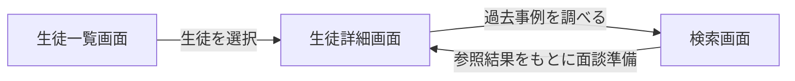

# ダッシュボード設計

## 目的

このドキュメントでは、コーチ向けダッシュボードの情報設計を整理する。  
対象は、生徒一覧画面、生徒詳細画面、検索画面の3つである。

このダッシュボードの役割は、情報を蓄積すること自体ではなく、**コーチが日々の運営と面談準備に必要な判断を短時間で行える状態を作ること** にある。  
そのため、画面設計は UI の見た目よりも、何を判断するために、どの情報を、どの順で見せるかを優先している。

---

## ダッシュボード全体像

ダッシュボードは、次の3画面で構成した。

- 生徒一覧画面
- 生徒詳細画面
- 検索画面

この3画面は、それぞれ独立した機能ではなく、**一覧で状態を把握し、詳細で個別状況を確認し、必要に応じて検索で過去事例を参照する** という流れで接続している。

---

## このダッシュボードで支援した判断

コーチにさせたかった判断は、主に次の4つである。

- 面談準備
- 提出フォロー
- 情報の管理
- 過去事例の参照

したがって、画面設計でも、単なる閲覧より **次に何を判断するか** を優先して情報を置いている。

---

## 画面構成

### 1. 生徒一覧画面

生徒一覧画面は、運営全体の状態を俯瞰するための画面である。  
用途は、個別の深掘りではなく、**今どの生徒を先に確認すべきかを決めること** にある。

#### 主な表示項目

- 生徒名
- Daily の点数推移
- 直近のレポート
- 目標
- Daily 履歴
- 未提出
- Daily 完了
- レポート送信状況
- 保護者へのレポート送信状況

#### この画面でできること

- 生徒の状態を横断的に確認する
- 提出漏れや未対応を見つける
- 直近の変化が大きい生徒を把握する
- 面談準備が必要な生徒を選ぶ
- 生徒詳細画面へ遷移する

#### 設計意図

この画面では、情報を広く見ることを優先している。  
面談内容の詳細や全文履歴を出すのではなく、まず **状態の変化と対応要否を判定するための情報** を並べている。

一覧画面で最初に見るべきものは、詳細な記録ではなく、

- 提出されているか
- 状態が落ちていないか
- 直近で何か変化があったか

である。  
そのため、Daily の点数推移や直近レポートを優先的に置いている。

---

### 2. 生徒詳細画面

生徒詳細画面は、1人の生徒について面談準備と継続支援に必要な情報を集約して確認するための画面である。  
一覧画面が「誰を見るか」を決める画面だとすれば、詳細画面は **その生徒をどう支援するかを考える画面** である。

#### 主な表示順

- 生徒名
- 目標
- Daily 点数推移
- 直近のレポート
- Daily 履歴

#### この画面でできること

- 現在の目標を確認する
- Daily の推移から最近の状態変化を把握する
- 直近の週次 / 月次レポートを参照する
- Daily 履歴から面談前に必要な文脈を確認する
- 必要に応じて検索画面で過去事例を調べる

#### 表示順の理由

表示順は、**面談で先に必要になる情報から順に並べている**。

最初に必要なのは、「誰で、今どの目標に向かっていて、直近の状態はどうか」である。  
そのため、生徒名と目標を最上段に置き、その次に Daily 点数推移を置いている。  
点数推移を見ることで、最近の状態が安定しているか、落ちているか、上向いているかを短時間で把握できる。

その後に直近のレポートを置くことで、面談前に要約済みの文脈を確認できるようにした。  
Daily 履歴は重要だが全文量が多いため、最上段ではなく、直近レポートの下に置いている。

#### レポートの扱い

レポートの承認は Discord 側で行っていたため、ダッシュボードでは承認UIを持たせず、**過去のレポートを参照する用途** に寄せている。  
この分離により、承認フローは Discord の運用導線に残しつつ、ダッシュボードは履歴参照と準備用途に集中できる。

---

### 3. 検索画面

検索画面は、過去の生徒事例や記録を参照し、現在の支援に再利用するための画面である。  
用途は単純な全文検索ではなく、**過去の類似ケースをもとに、今の生徒への支援方針を考えること** にある。

#### 入力形式

- 自由検索

#### 出力形式

- 冒頭の要約文
- 事例からわかるベストプラクティス
- 事例一覧
- 原文根拠

#### この画面でできること

- 過去の似た事例を探す
- 事例から共通点や支援方針を把握する
- 原文根拠までたどる
- 面談準備や支援方針の検討に使う

#### 設計意図

検索結果は、候補一覧だけを返す形にはしていない。  
それだけではコーチ側で再解釈が必要になり、検索結果を実務で使いにくくなるためである。

そのため、検索結果は次の順で返す構成にしている。

1. まず要約文で全体像を把握する
2. 次にベストプラクティスとして再利用可能な観点を示す
3. その後に事例一覧を見る
4. 必要なら原文根拠までたどる

この順にすることで、**読む量を減らしつつ、必要なら根拠確認もできる** 構成にしている。

---

## 情報設計上の判断

### 一覧と詳細の役割を分ける

一覧画面では、横断的な状態把握を優先する。  
詳細画面では、個別支援の判断に必要な文脈を優先する。  
この分離により、全員の状態確認と、個別の深掘りを同じ画面に混在させずに済む。

### 面談準備に必要な順で情報を並べる

生徒詳細画面では、  
生徒名 → 目標 → 点数推移 → 直近レポート → Daily 履歴  
の順に置いている。  
これは、面談前にまず目標と直近状態を把握し、その後に詳細文脈を確認する流れに合わせている。

### 承認操作は Discord、参照はダッシュボードに分ける

承認フローまでダッシュボードに持ち込まず、Discord 側で行う構成を維持した。  
ダッシュボードは過去レポート参照と情報集約に集中させることで、画面責務を明確にしている。

### 検索は候補表示ではなくレポート形式で返す

自由検索の結果を、候補一覧だけで終わらせず、要約文、ベストプラクティス、事例一覧、原文根拠の順で返す。  
この形により、検索結果をそのまま面談準備や支援判断に使いやすくしている。

### 情報は隠すより構造化で整理する

今回の画面では、情報量が多いこと自体は課題だったが、折りたたみや過度な非表示で対応する必要はなかった。  
情報の粒度と順序を整理し、画面ごとの役割を分けることで、構造として読みやすい状態を作った。

---

## ステータス設計

一覧画面で扱う代表的なステータスは次の通り。

- 未提出
- Daily 完了
- レポート送信状況
- 保護者へのレポート送信状況

これらは、コーチが今すぐ対応すべき事項を判断するための指標として使う。  
状態の詳細な理由を一覧画面で全部見せるのではなく、まず対応要否が分かる形で見せることを優先している。

---

## このダッシュボードが担う役割

このダッシュボードは、単なる管理画面ではなく、次の役割を持つ。

- 運営全体の状態を把握する
- 個別生徒の支援文脈を確認する
- 過去レポートと Daily 履歴を参照する
- 過去事例を現在の支援へ再利用する
- 面談準備と提出フォローを効率化する

結果として、このダッシュボードは「記録をためる画面」ではなく、**コーチが判断するための画面** として設計している。

---

## まとめ

ダッシュボード設計では、次の3点を優先した。

1. 一覧と詳細の役割を分けること
2. 面談準備に必要な順で情報を並べること
3. 検索結果を再利用しやすい形式で返すこと

この設計により、提出状況の把握、面談準備、過去事例参照を、複数のスプレッドシートや記録を横断せずに行える構成にした。
